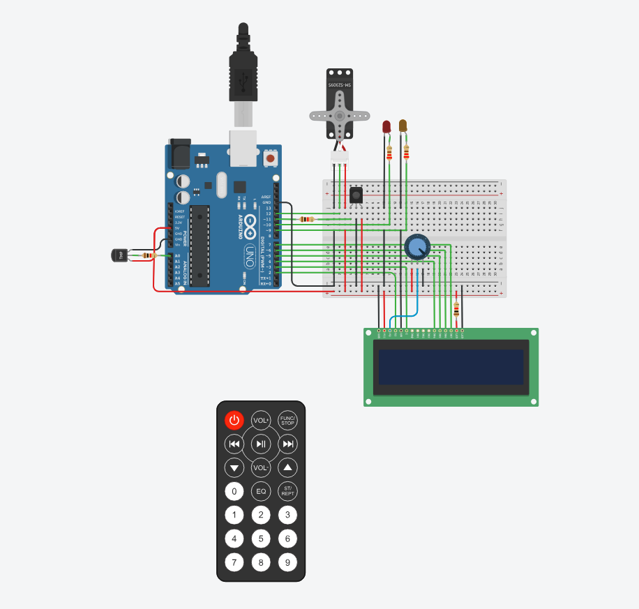
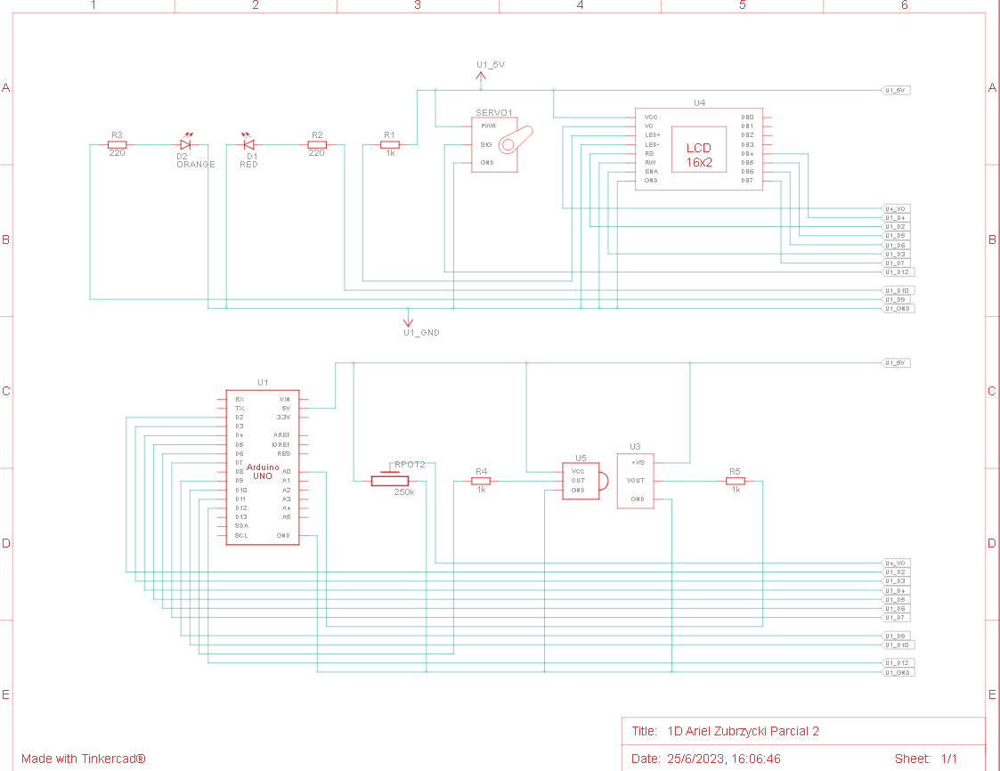

# Parcial 

## Integrantes 
- Ariel Zubrzycki 

## Proyecto: Sistema de alarma de incendio

## Diagrama esquematico:

## Descripción
Diseñar un sistema de incendio utilizando Arduino que pueda 
detectar cambios de temperatura y activar un servo motor en caso de detectar un 
incendio. Además, se mostrará la temperatura actual y la estación 
del año en un display LCD. 

## Requisitos del parcial
Componentes necesarios: 
Arduino UNO 
Sensor de temperatura 
Control remoto IR Infrarrojo
Display LCD 16x2 caracteres
Servo motor 
Cables y resistencias según sea necesario 
Protoboard para realizar las conexiones 
Dos leds. 
Funcionalidad requerida: 

Conexiones: 
Conecta el sensor de temperatura al pin analógico A0 de Arduino. 
Conecta el control remoto IR al pin digital 11 de Arduino. 
Conecta el display LCD utilizando los pines correspondientes de Arduino. Conecta el servo motor a uno de los pines PWM de Arduino (por ejemplo, pin 9). 
Control remoto: 
Configura el control remoto IR para recibir señales. 
Define los comandos necesarios para activar y desactivar el sistema de incendio. Utiliza un algoritmo para determinar la estación del año (por ejemplo, rangos de temperatura para cada estación). 

Detección de temperatura: 
Configura el sensor de temperatura y realiza la lectura de la temperatura ambiente. Muestra la temperatura actual en el display LCD. 

Sistema de Procesamiento de Datos Sistema de alarma: 
Define un umbral de temperatura a partir del cual se considera que hay un incendio. 
Cuando se detecta un incendio, se activa el servo motor para simular una respuesta del sistema de incendio. 

Mensajes en el display LCD: 
Muestra la temperatura actual y la estación del año en el display LCD. Cuando se detecta un incendio, muestra un mensaje de alarma en el display LCD. 

Punto libre: 
Se deberá agregar dos leds y darle una funcionalidad de su elección, acorde al proyecto previamente detallado. 
Recuerda proporcionar un diagrama de conexiones y el código necesario para implementar cada una de las funcionalidades requeridas. Esto ayudará a comprender y construir el sistema de incendio con Arduino. 

~~~ C (lenguaje en el que esta escrito)
#define servoPin 12
#include <Servo.h>
#define sensorTemperatura 11
#define ledUno 10
#define ledDos 9
#include <LiquidCrystal.h>
LiquidCrystal lcd(2, 3, 4, 5, 6, 7);
Servo myServo;

int sensor = 0;
int gradosCelsius = 0;
int estado = LOW;
int sistema;
void setup()
{
  Serial.begin(9600);
  lcd.begin(16, 2);
  myServo.attach(servoPin);
  myServo.attach(servoPin, 500, 2500);
  pinMode(11, INPUT);
  pinMode(sensorTemperatura, INPUT);
  pinMode(ledUno, OUTPUT);
  pinMode(ledDos, OUTPUT);
}

void loop()
{
  sensor = digitalRead(11);
  Serial.println(sensor);
  
  if (sensor == LOW) 
  {
    estado = !estado;
    digitalWrite(ledUno, estado);
    sistema = estado;
    delay(500);
  }
 
  if(sistema == HIGH)
  {
    temperaturaActual();
  	mostrarEnPantalla();
  }
}

void temperaturaActual()
{
  gradosCelsius = analogRead(A0);
  gradosCelsius = map(gradosCelsius, 20, 358, 0, 50);
  Serial.println(gradosCelsius);
}

void determinarEstacion()
{
  if(gradosCelsius >= 0 && gradosCelsius < 10)
  {
    lcd.print("EST:INVIERNO"); 
  }
  else
  {
    if(gradosCelsius >= 10 && gradosCelsius < 20)
    {
      lcd.print("EST:OTONO"); 
    }
    else
    {
      if(gradosCelsius >= 20 && gradosCelsius < 25)
      {
        lcd.print("EST:PRIMAVERA"); 
      }
      else
      {
        if(gradosCelsius >= 25 && gradosCelsius <= 40)
        {
          lcd.print("EST:VERANO"); 
        }
        else
        {
          if(gradosCelsius > 40)
          {
            lcd.print("INCENDIO"); 
          }
        }
      }
    }
  }
}

void alarmaDeIncendio()
{
  myServo.write(180);
  delay(500);
  myServo.write(0);
  digitalWrite(ledDos, HIGH);
  delay(100);
  digitalWrite(ledDos, LOW);
}

void mostrarEnPantalla()
{
  lcd.clear();
  if(gradosCelsius < 40)
  {
    lcd.setCursor(0,0); 
    lcd.print("TEMP:");
    lcd.print(gradosCelsius);
    lcd.print("C");
    lcd.setCursor(0,1);
    determinarEstacion();
  }
  else
  {
    lcd.setCursor(3,0);
    lcd.print("SE DETECTO");
    lcd.setCursor(3,1);
    lcd.print("UN INCENDIO");
    alarmaDeIncendio();
  }
  delay(200);
}
~~~

## :robot: Link al proyecto
- [proyecto](https://www.tinkercad.com/things/gZauWzBEgMI-1d-ariel-zubrzycki-parcial-2/editel?sharecode=eWTjv2weoLvk5eSzU-bvojdah_56u761JZwfXmDw57c)

